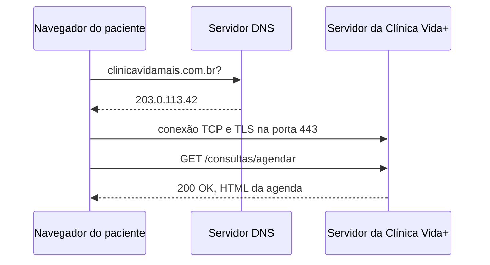

## O caminho de uma requisição



## Evidência do DNS

```
Server:         127.0.0.53
Address:        127.0.0.53#53

Non-authoritative answer:
Name:   github.com
Address: 140.82.113.4
```


Evidência do HTTP
Método             Recurso                       Status 
GET       gitkraken-client-github-desktop         200 OK
GET       svg-with-js.css                         200 OK
GET       style.min.css?ver=2.3.1                 200 OK
GET       /pagina-que-nao-existe                  404 Not Found

Justificativa do HTTPS:

O formulário de agendamento da Clínica Vida+ exige o uso do protocolo HTTPS para garantir a segurança dos dados transmitidos entre o navegador do paciente e o servidor por meio da criptografia TLS. Como a página trafega informações pessoais e sensíveis, como o CPF do paciente e dados de consultas médicas, o HTTPS garante a privacidade do usuário e impede a interceptação do tráfego na rede.

